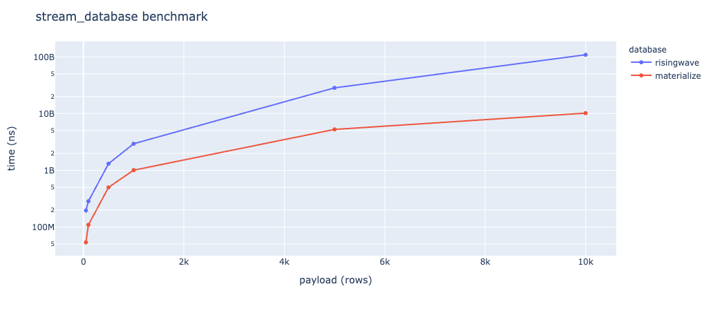

## Source

- GitHub Repository: <https://github.com/CornDavid5/cs511-project>
- Branch: `main`
- Commit SHA-1 ID: `f77fa3304027160347bf6085d314be76220aeb57`


<div style="page-break-after: always"></div>

## Original Proposal

### Goals

#### What you aim to study?

Comparing performance differences for common use cases of [Materialize](https://materialize.com/) and [Risingwave](https://www.risingwave.dev/)

- [Materialize](https://github.com/MaterializeInc/materialize)
- [Risingwave](https://github.com/risingwavelabs/risingwave)

#### Why it is important?

`Materialize` is a streaming database powered by `Timely` and `Differential Dataflow`, purpose-built for low-latency applications. It lets you ask complex questions about your data using SQL, and maintains the results of these SQL queries incrementally up-to-date as the underlying data changes.

`RisingWave` is a cloud-native streaming database that uses SQL as the interface language. It is designed to reduce the complexity and cost of building real-time applications. RisingWave consumes streaming data, performs continuous queries, and updates results dynamically. As a database system , RisingWave maintains results inside its own storage and allows users to access data efficiently.

From a quick glance, we noticed these two rising streaming database stars. Both are implemented in Rust. And the two have fairly overlapping functions and aim to solve similar domain problems.
The interfaces provided by the two databases for streaming queries are similar: they both provide support for PostgreSQL-compatible syntax.

We want to use this as an entry point to dive deep into the streaming database's feature set and explore the feature sets provided by the two databases and compare their performance differences for some common basic use cases.

<div style="page-break-after: always"></div>

#### How you want to evaluate it?

We will divide this task into four parts to deliver incrementally.

1. Set up test environments for these two databases in the same hardware environment.
2. Choose 3 - 5 different common scenarios to reproduce in each of the two databases.
3. Document and analyze performance differences and possible causes for these common base use cases.
4. Deliver documentation, which should document: (1) The feature set of a modern streaming database. (2) Some basic streaming database use cases. (3) Materialize and Risingwave support and performance for these use cases.

<div style="page-break-after: always"></div>

## Key results & Explanations

### Hardware configuration

```bash
# uname -a
Darwin Huimings-MacBook-Pro.local 21.1.0 Darwin Kernel Version 21.1.0 arm64
# sw_vers
ProductName:    macOS
ProductVersion: 12.0.1
BuildVersion:   21A559
# sysctl -n machdep.cpu.brand_string
Apple M1 Pro
# sysctl hw.ncpu
hw.ncpu: 8
# sysctl hw.memsize
hw.memsize: 34359738368
# system_profiler SPHardwareDataType
Hardware:
    Hardware Overview:
      Model Name: MacBook Pro
      Model Identifier: MacBookPro18,3
      Chip: Apple M1 Pro
      Total Number of Cores: 8 (6 performance and 2 efficiency)
      Memory: 32 GB
```

<div style="page-break-after: always"></div>

docker config

```bash
# docker info
Client:
 Context:    default
 Debug Mode: false
 Plugins:
  buildx: Build with BuildKit (Docker Inc., v0.6.3)
  compose: Docker Compose (Docker Inc., v2.1.1)
  scan: Docker Scan (Docker Inc., 0.9.0)

Server:
 Server Version: 20.10.10
 Storage Driver: overlay2
  Backing Filesystem: extfs
  Supports d_type: true
  Native Overlay Diff: true
  userxattr: false
 Logging Driver: json-file
 Cgroup Driver: cgroupfs
 Cgroup Version: 1
 Plugins:
  Volume: local
  Network: bridge host ipvlan macvlan null overlay
  Log: awslogs fluentd gcplogs gelf journald json-file local logentries splunk syslog
 Swarm: inactive
 Runtimes: io.containerd.runc.v2 io.containerd.runtime.v1.linux runc
 Default Runtime: runc
 Init Binary: docker-init
 containerd version: 5b46e404f6b9f661a205e28d59c982d3634148f8
 runc version: v1.0.2-0-g52b36a2
 init version: de40ad0
 Security Options:
  seccomp
   Profile: default
 Kernel Version: 5.10.47-linuxkit
 Operating System: Docker Desktop
 OSType: linux
 Architecture: aarch64
 CPUs: 5
 Total Memory: 7.765GiB
 Name: docker-desktop
 ID: 4KK3:FDMH:QOUU:MSMD:74K3:HDUN:DAY4:AP4S:NER3:P2V4:2VAE:G5FV
 Docker Root Dir: /var/lib/docker
 Debug Mode: false
 HTTP Proxy: http.docker.internal:3128
 HTTPS Proxy: http.docker.internal:3128
 Registry: https://index.docker.io/v1/
 Labels:
 Experimental: false
 Insecure Registries:
  127.0.0.0/8
 Live Restore Enabled: false
```

go config

```bash
# go version
go version go1.18.1 darwin/arm64
```

<div style="page-break-after: always"></div>

### Set up test environments for these two databases in the same hardware environment

#### [Risingwave](./risingwave/)

Create docker network.

```bash
docker network create -d bridge risingwave
```

Start risingwave in standalone mode.

```bash
docker run --rm -it \
  --name risingwave \
  --network risingwave \
  -p 4566:4566 \
  -p 5691:5691 \
  risingwavelabs/risingwave \
  playground
```

Get risingwave service ip address.

```bash
RISINGWAVE_HOST="$(docker inspect risingwave | jq -r ".[].NetworkSettings.Networks.risingwave.IPAddress")"
# OR
docker network inspect risingwave | jq -r '.[].Containers[] | select(.Name == "risingwave") | .IPv4Address'
```

Connect to risingwave instance with psql.

```bash
docker run --rm -it \
  --name psql \
  --network risingwave \
  postgres:15.1 \
  psql -h "$RISINGWAVE_HOST" \
  -p 4566 \
  -d dev \
  -U root
```

Let's run some quick examples to confirm the basic functionality works.

```sql
CREATE TABLE taxi_trips(
    id VARCHAR,
    distance DOUBLE PRECISION,
    duration DOUBLE PRECISION
);
```

```sql
CREATE MATERIALIZED VIEW mv_avg_speed
AS
    SELECT COUNT(id) as no_of_trips,
    SUM(distance) as total_distance,
    SUM(duration) as total_duration,
    SUM(distance) / SUM(duration) as avg_speed
    FROM taxi_trips;
```

```sql
INSERT INTO taxi_trips
VALUES
    ('1', 4, 10);
```

```sql
SELECT * FROM mv_avg_speed;
```

```sql
INSERT INTO taxi_trips
VALUES
    ('2', 6, 10);
```

```sql
SELECT * FROM mv_avg_speed;
```

<div style="page-break-after: always"></div>

#### [Materialize](./materialize/)

```yaml
version: '3.8'
services:
  postgres:
    image: postgres:15.1-alpine
    container_name: p4-postgres
    restart: always
    ports:
     - 5432:5432
    environment:
     - POSTGRES_USER=postgres
     - POSTGRES_PASSWORD=postgres
     - POSTGRES_DB=postgres
    volumes:
     - ${PWD}/postgres:/docker-entrypoint-initdb.d
  materialized:
    image: materialize/materialized:v0.26.5
    container_name: p4-materialized
    restart: always
    ports:
      - 6875:6875
    depends_on:
      - postgres
```

- start all the containers, run `docker-compose up -d`
- (optional) check postgres database, run `psql -U postgres -h localhost -p 5432 -d postgres`
- create postgres source for Materialize
- launch the Materialize CLI, run `docker-compose run mzcli`
- create a Postgres Materialize Source, run

``` sql
CREATE SOURCE IF NOT EXISTS 
taxi_trips_publication_source FROM POSTGRES
CONNECTION 
'user=postgres port=5432 host=postgres dbname=postgres password=postgres'
PUBLICATION 'taxi_trips_publication_source';
```

- create a view to represent the upstream publication's original tables, run

``` sql
CREATE MATERIALIZED VIEWS FROM SOURCE taxi_trips_publication_source (taxi_trips);
```

- create a materialized view, run

``` sql
CREATE MATERIALIZED VIEW mv_avg_speed AS
    SELECT COUNT(id) as no_of_trips,
        SUM(distance) as total_distance,
        SUM(duration) as total_duration,
        SUM(distance) / SUM(duration) as avg_speed
    FROM taxi_trips;
```

- query the materialized view, run

``` sql
SELECT * FROM mv_avg_speed;
```

<div style="page-break-after: always"></div>

### [Benchmark](./postgres/)

We use golang to write a test program that generates a large amount of payload and measures the benchmark. This test is designed to test the baseline performance difference between risingwave and materialize. Since both databases have a considerable number of parameters to set, we only use the standalone mode and default configuration of these two databases for performance testing. This benchmark is not completely accurate and does not fully reflect the extreme performance of these two databases in a production environment. We just wanted to do a basic proof-of-concept of the basic functionality and speed of streaming databases.

Build the benchmark program.

```bash
risingwave-benchmark

Usage:
  risingwave-benchmark [flags]

Flags:
      --conn-str string      
      connection string
      --force-flush          
      false flush (Only available in risingwave. 
      This will force flush the changes made by insert
      before the query.)
  -h, --help                 
      help for risingwave-benchmark
      --insert-num int       
      insert rows number (default 10)
      --query-factor float   
      query factor (default 1.0) 
      (The benchmark will gradually query 
      (insert-num * query-factor) times 
      in the middle of the insert)
      --random               
      insert random data
      --verbose              
      set verbose output, 
      this will print the output of query to stdout
```

```bash
just build-linux-amd64
```

Create risingwave benchmark network

```bash
docker network create -d bridge risingwave
```

Start risingwave in standalone mode.

```bash
docker run --rm -it \
  --name risingwave \
  --network risingwave \
  -p 4566:4566 \
  -p 5691:5691 \
  risingwavelabs/risingwave \
  playground
```

Run risingwave benchmark

```bash
docker run --rm -it \
  --name risingwave_benchmark \
  --network risingwave \
  -v "$(pwd)/bin:/app" \
  ubuntu:20.04 \
  /app/risingwave-benchmark-linux-amd64 \
  --conn-str "host=172.18.0.2 port=4566 user=root dbname=dev sslmode=disable" \
  --insert-num 20 \
  --query-factor 0.5 \
  --verbose \
  --force-flush \
  --random
```

Fetch materialize service ip address

```bash
docker network inspect materialize_default | jq  -r '.[].Containers[] | select(.Name == "p4-materialized") | . '
```

Run materialize benchmark.

```bash
docker run --rm -it \
  --name materialize_benchmark \
  --network materialize_default \
  -v "$(pwd)/bin:/app" \
  ubuntu:20.04 \
  /app/risingwave-benchmark-linux-amd64 \
  --conn-str "host=172.22.0.4 port=6875 user=materialize dbname=materialize sslmode=disable" \
  --insert-num 20 \
  --query-factor 0.5 \
  --verbose
```

<div style="page-break-after: always"></div>

### Benchmark result



Both risingwave and materialize have relatively consistent performance, and risingwave has some relative constant-level performance advantages. We speculate that this is due to the different architectures of risingwave and materialize, you can see a detailed discussion of risingwave and materialize below, in addition, materialize does not have an explicit flush, which may cause it to be slower than risingwave one of the reasons. Both risingwave and materialize's stream aggregation query are significantly faster than traditional databases.

While experimenting with both databases, we found some pain points, despite both databases claiming compatibility with postgres. But the actual experience was not so friendly.

- Weak support for transactions,
- Lack of support for some features of postgres, such as `CREATE TABLE IF NOT EXIST`.
- Risingwave performs periodic synchronization to synchronize MATERIALIZED VIEW, if we want to get the current accurate attempt, we will need to run the flush command manually, the difference is that materialize doesn't even support the flush command.

<div style="page-break-after: always"></div>

### Core functionality provided by Streaming database

This is 3 common scenarios we found necessary for streaming databases.

- Read from an data sources (Kafka/Redpanda/PostgreSQL/Change Data Capture (CDC)/etc)
- Provides a SQL compatibility layer to process streaming data
- Write to an external sink (Kafka/Redpanda)

<div style="page-break-after: always"></div>

## Materialize: A streaming database for real-time applications and analytics

- Optimized for view maintenance over streaming data
- Ingest data from a range of sources
- Query in standard SQL
- Incremental view updates
- connect to an ecosystem of tools
- Materialize will be fed the updates from the sources the user wants to query at low latency. With the upstream sources connected, we can define views,which are queries we want to repeatedly perform using the PostgreSQL syntax. Finally, we can query these views using regular SQL, or ask Materialize to proactively send changes back to streaming sinks.


## How it satisfies the proposal requirements

- [x] Set up test environments for these two databases in the same hardware environment.
- [x] Choose 3 - 5 different common scenarios to reproduce in each of the two databases.
- [x] Document and analyze performance differences and possible causes for these common base use cases.
- [x] Deliver documentation, which should document: (1) The feature set of a modern streaming database. (2) Some basic streaming database use cases. (3) Materialize and Risingwave support and performance for these use cases.

We delivered all the tasks we stated in the proposal document.
